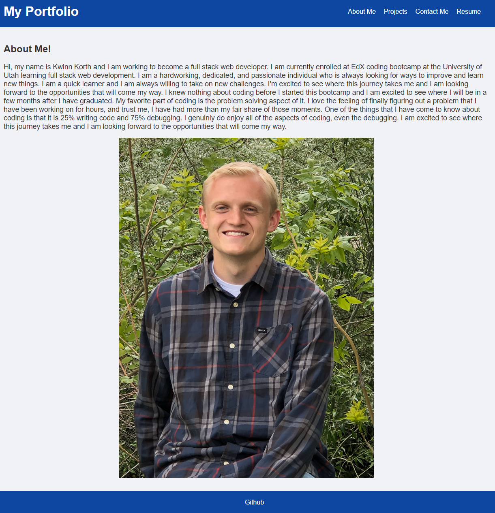

# React-Portfolio

## Description

This is a portfolio I built so I could both showcase my work but also become more familiar with React and different elements of building and deploying an application.

## Table of Contents

- [Installation](#installation)
- [Usage](#usage)
- [License](#license)
- [Contributing](#contributing)
- [Tests](#tests)
- [Questions](#questions)

## Installation

You can clone the repo to your local machine.

## Usage

You could replace all of my stuff with your own and change the style.

## License

This project is licensed under the [MIT License](https://opensource.org/licenses/MIT).

## Contributing

Don't, its my portfolio.

## Tests

Run "npm run start" and see if it works.

## Deployed

Deployed Website: https://main--kwinnsportfolio.netlify.app

